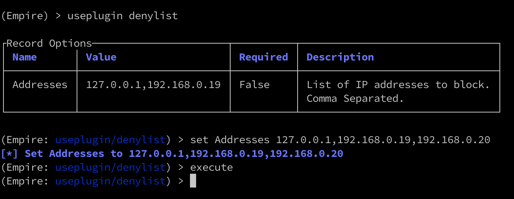
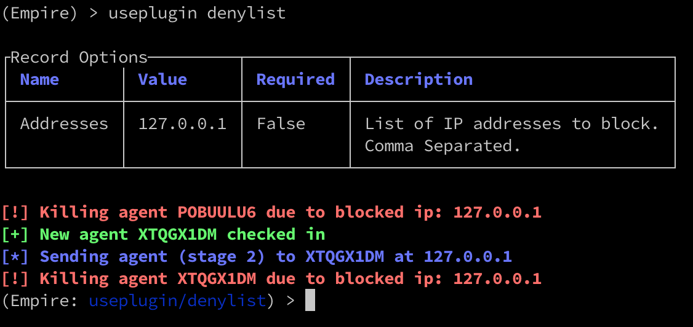

# Denylist-Plugin
The purpose of this plugin is to block certain IP addresses from connecting to the server.
It is to showcase the event-driven nature of the hook system.

## Install
Prerequisites:
- Empire >=4.3.3

4.3.3 adds the `hooks.AFTER_AGENT_STAGE2_HOOK`

1. Add denylist.plugin to the plugins folder of Empire.

## Usage
The plugin automatically registers to the hook when Empire is started.

To change the list of blocked IPs, update the `Addresses` field on the plugin and execute.

To see agents that are blocked, go to the plugin's menu `useplugin denylist`.
